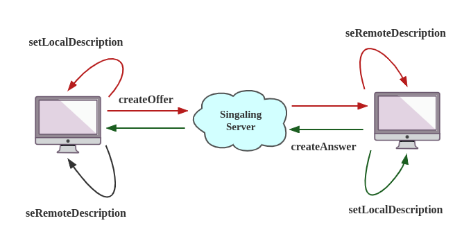
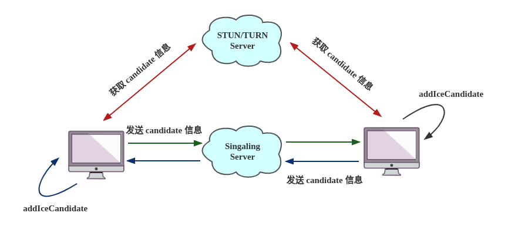

该项目基于 WebRTC + WebSocket 实现 1V 1视频通话。


### 安装及运行流程

1. 下载代码

```git
https://gitee.com/shusheng227/web-development.git
```

2. 修改网关

   在自己电脑上或远程主机上搭建 Web 服务器环境，本地可参考 https://www.yuque.com/shusheng227/cglq4h/gieeye。

   搭建后根据自己的 ip 修改服务端和客户端代码中ip。

   服务端代码是 chatServer.py，使用变量 SIGNALING_HOST 和 SIGNALING_PORT 表示地址和端口。

   客户端关键代码是 main.js，使用变量 SIGNALING_SERVER 表示地址。

3. 运行信令服务器

   该项目使用 Python WebSocket 构建信令服务器，它基于asyncio异步IO建立，提供基于协程的API。

   请尽量使用Python ≥ 3.6以上版本来运行 WebSockets。

   ```bash
   pip3 install websockets
   python3 chat_server.py
   ```

   chat_server.py 默认使用本地 8888 端口启动服务器。
   
4. 在两个浏览器打开 index.html，运行即可。


### 代码流程






## 参考

- [HTML5 WebSocket | 菜鸟教程](https://www.runoob.com/html/html5-websocket.html)

- [webRTC结合webSocket实时通信 | 掘金](https://juejin.cn/post/6844904008608382984)

